# Technical Diagrams — Inline Rendering for Web Apps

Generate beautiful technical diagrams from text using Mermaid.js. This skill covers diagram type selection, syntax reference, browser rendering, dark theme integration, and LLM generation best practices.

## Why Mermaid.js

Mermaid is the right choice for AI-generated inline diagrams because:

- **Client-side rendering** — no server needed, renders to SVG in the browser
- **LLM reliability** — most training data of any diagram language; LLMs generate valid Mermaid with high accuracy
- **Industry standard** — GitHub, ChatGPT, Notion, Obsidian, GitLab all render Mermaid natively
- **20+ diagram types** — C4, sequence, flowchart, class, state, ER, Gantt, mindmap, timeline, architecture, and more
- **Dark theme support** — built-in dark theme plus full custom theming via `themeVariables`
- **SVG output** — scalable, accessible, CSS-styleable, text-selectable

Alternatives and when to consider them:
| Tool | Use when | Limitation |
|------|----------|------------|
| **Graphviz (Viz.js WASM)** | DOT language graphs, dependency trees | ~2MB WASM, static SVG only |
| **ELK.js + Svelte Flow** | Interactive, draggable architecture diagrams | Layout-only, needs custom renderer |
| **Kroki** | Need PlantUML/D2/Structurizr server-side | Requires Docker infrastructure |
| **PlantUML** | Enterprise sequence diagrams with deep UML | Java server, no client-side |

## Choosing the Right Diagram Type

| When you need to show… | Use | Mermaid keyword |
|------------------------|-----|-----------------|
| System context / boundaries | C4 Context | `C4Context` |
| Containers in a system | C4 Container | `C4Container` |
| Components in a container | C4 Component | `C4Component` |
| Deployment topology | C4 Deployment | `C4Deployment` |
| Request/response flow between services | Sequence | `sequenceDiagram` |
| Process flow / decision logic | Flowchart | `flowchart` |
| Object relationships / data model | ER Diagram | `erDiagram` |
| Class hierarchy / interfaces | Class Diagram | `classDiagram` |
| State transitions | State Diagram | `stateDiagram-v2` |
| Project timeline / milestones | Timeline | `timeline` |
| Task breakdown / planning | Gantt | `gantt` |
| Concept hierarchy / brainstorm | Mindmap | `mindmap` |
| User workflow experience | User Journey | `journey` |
| Feature prioritization | Quadrant | `quadrantChart` |
| Data distribution | Pie | `pie` |
| Git branching strategy | Git Graph | `gitGraph` |
| Infrastructure layout | Architecture (beta) | `architecture-beta` |
| Data flow volumes | Sankey | `sankey-beta` |
| Metrics / trends | XY Chart | `xychart-beta` |

## Syntax Reference

### Flowchart

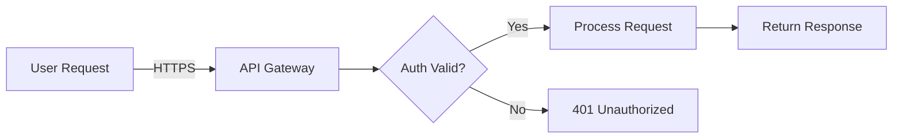
```mermaid
flowchart LR
    A["User Request"] -->|"HTTPS"| B["API Gateway"]
    B --> C{"Auth Valid?"}
    C -->|"Yes"| D["Process Request"]
    C -->|"No"| E["401 Unauthorized"]
    D --> F["Return Response"]
```

Direction options: `TB` (top-bottom), `BT`, `LR` (left-right), `RL`

Node shapes:
- `A["Rectangle"]` — default
- `A("Rounded")` — rounded corners
- `A{"Diamond"}` — decision
- `A[("Cylinder")]` — database
- `A(("Circle"))` — circle
- `A[/"Parallelogram"/]` — input/output
- `A{{"Hexagon"}}` — preparation

Edge styles:
- `-->` solid arrow
- `-.->` dotted arrow
- `==>` thick arrow
- `-->|"label"| ` labeled edge
- `--- ` line without arrow

Subgraphs for grouping:
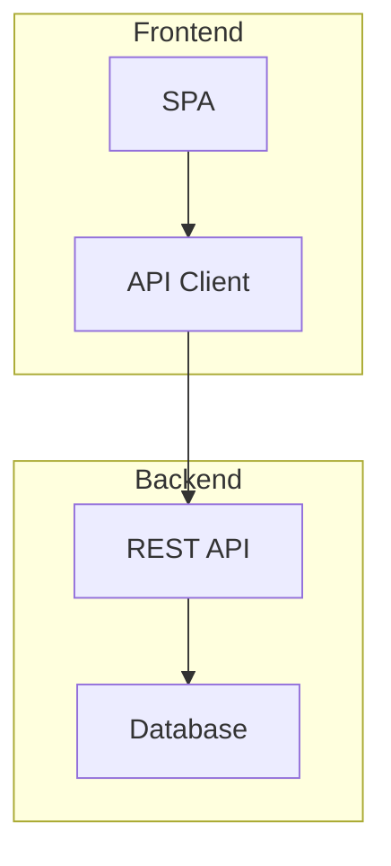
```mermaid
flowchart TB
    subgraph Frontend
        A["SPA"] --> B["API Client"]
    end
    subgraph Backend
        C["REST API"] --> D["Database"]
    end
    B --> C
```

### Sequence Diagram

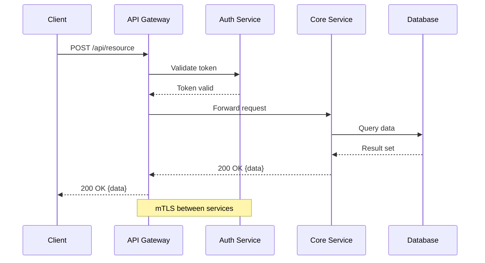
```mermaid
sequenceDiagram
    participant C as Client
    participant G as API Gateway
    participant A as Auth Service
    participant S as Core Service
    participant D as Database

    C->>G: POST /api/resource
    G->>A: Validate token
    A-->>G: Token valid
    G->>S: Forward request
    S->>D: Query data
    D-->>S: Result set
    S-->>G: 200 OK {data}
    G-->>C: 200 OK {data}

    Note over G,A: mTLS between services
```

Arrow types:
- `->>` solid with arrowhead
- `-->>` dashed with arrowhead
- `-x` solid with cross (async/fire-and-forget)
- `--x` dashed with cross

Features:
- `activate`/`deactivate` for lifeline boxes
- `loop`, `alt`/`else`, `opt`, `par`, `critical`, `break` blocks
- `Note over A,B: text` for notes
- `rect rgb(50,50,50)` for colored backgrounds

### C4 Context Diagram

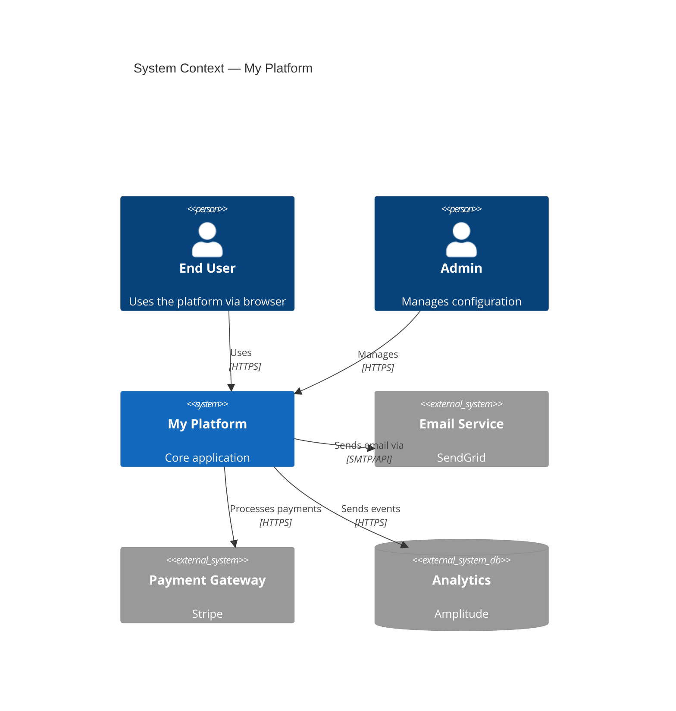
```mermaid
C4Context
    title System Context — My Platform

    Person(user, "End User", "Uses the platform via browser")
    Person(admin, "Admin", "Manages configuration")

    System(platform, "My Platform", "Core application")
    System_Ext(email, "Email Service", "SendGrid")
    System_Ext(payments, "Payment Gateway", "Stripe")
    SystemDb_Ext(analytics, "Analytics", "Amplitude")

    Rel(user, platform, "Uses", "HTTPS")
    Rel(admin, platform, "Manages", "HTTPS")
    Rel(platform, email, "Sends email via", "SMTP/API")
    Rel(platform, payments, "Processes payments", "HTTPS")
    Rel(platform, analytics, "Sends events", "HTTPS")
```

### C4 Container Diagram

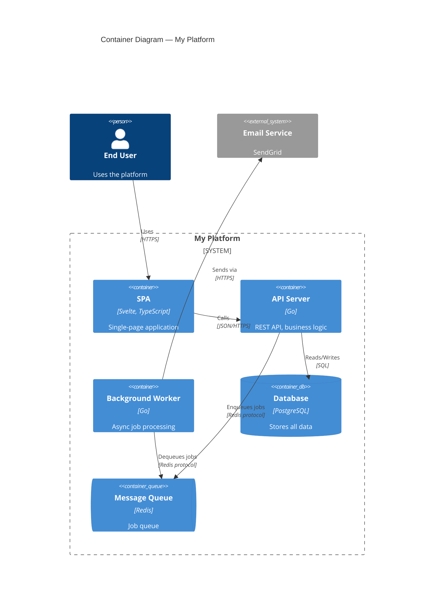
```mermaid
C4Container
    title Container Diagram — My Platform

    Person(user, "End User", "Uses the platform")

    System_Boundary(platform, "My Platform") {
        Container(spa, "SPA", "Svelte, TypeScript", "Single-page application")
        Container(api, "API Server", "Go", "REST API, business logic")
        Container(worker, "Background Worker", "Go", "Async job processing")
        ContainerDb(db, "Database", "PostgreSQL", "Stores all data")
        ContainerQueue(queue, "Message Queue", "Redis", "Job queue")
    }

    System_Ext(email, "Email Service", "SendGrid")

    Rel(user, spa, "Uses", "HTTPS")
    Rel(spa, api, "Calls", "JSON/HTTPS")
    Rel(api, db, "Reads/Writes", "SQL")
    Rel(api, queue, "Enqueues jobs", "Redis protocol")
    Rel(worker, queue, "Dequeues jobs", "Redis protocol")
    Rel(worker, email, "Sends via", "HTTPS")
```

### C4 Component Diagram

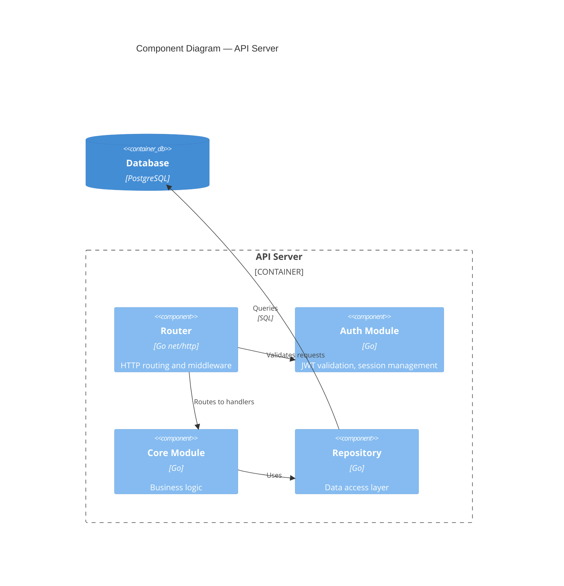
```mermaid
C4Component
    title Component Diagram — API Server

    Container_Boundary(api, "API Server") {
        Component(router, "Router", "Go net/http", "HTTP routing and middleware")
        Component(auth, "Auth Module", "Go", "JWT validation, session management")
        Component(core, "Core Module", "Go", "Business logic")
        Component(repo, "Repository", "Go", "Data access layer")
    }

    ContainerDb(db, "Database", "PostgreSQL")

    Rel(router, auth, "Validates requests")
    Rel(router, core, "Routes to handlers")
    Rel(core, repo, "Uses")
    Rel(repo, db, "Queries", "SQL")
```

### C4 Deployment Diagram

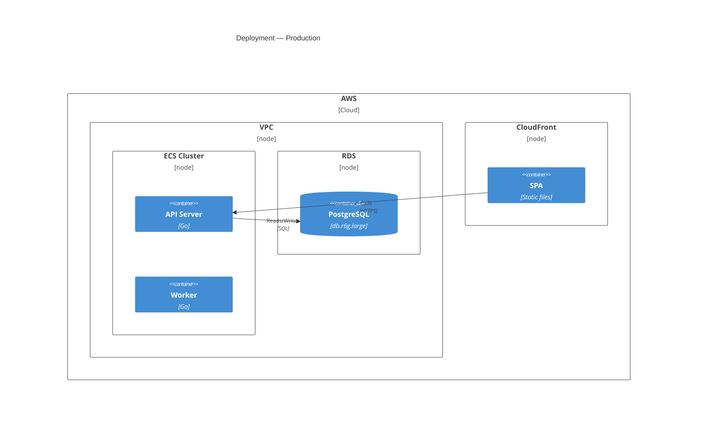
```mermaid
C4Deployment
    title Deployment — Production

    Deployment_Node(cloud, "AWS", "Cloud") {
        Deployment_Node(vpc, "VPC") {
            Deployment_Node(ecs, "ECS Cluster") {
                Container(api, "API Server", "Go")
                Container(worker, "Worker", "Go")
            }
            Deployment_Node(rds, "RDS") {
                ContainerDb(db, "PostgreSQL", "db.r6g.large")
            }
        }
        Deployment_Node(cdn, "CloudFront") {
            Container(spa, "SPA", "Static files")
        }
    }

    Rel(spa, api, "Calls", "HTTPS")
    Rel(api, db, "Reads/Writes", "SQL")
```

### Entity Relationship Diagram

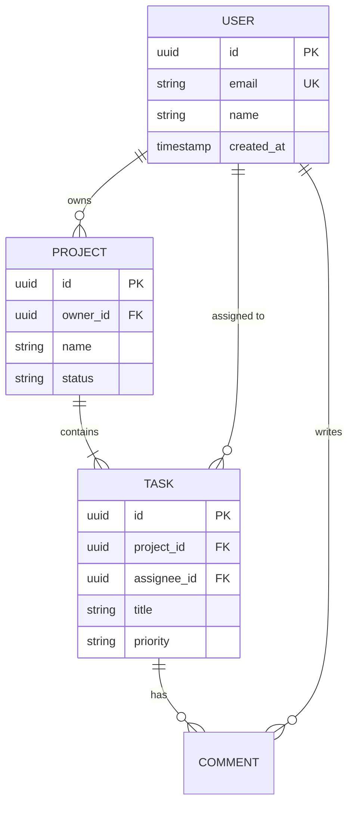
```mermaid
erDiagram
    USER ||--o{ PROJECT : owns
    PROJECT ||--|{ TASK : contains
    USER ||--o{ TASK : "assigned to"
    TASK ||--o{ COMMENT : has
    USER ||--o{ COMMENT : writes

    USER {
        uuid id PK
        string email UK
        string name
        timestamp created_at
    }
    PROJECT {
        uuid id PK
        uuid owner_id FK
        string name
        string status
    }
    TASK {
        uuid id PK
        uuid project_id FK
        uuid assignee_id FK
        string title
        string priority
    }
```

Cardinality: `||--||` one-to-one, `||--o{` one-to-many, `o{--o{` many-to-many

### Class Diagram

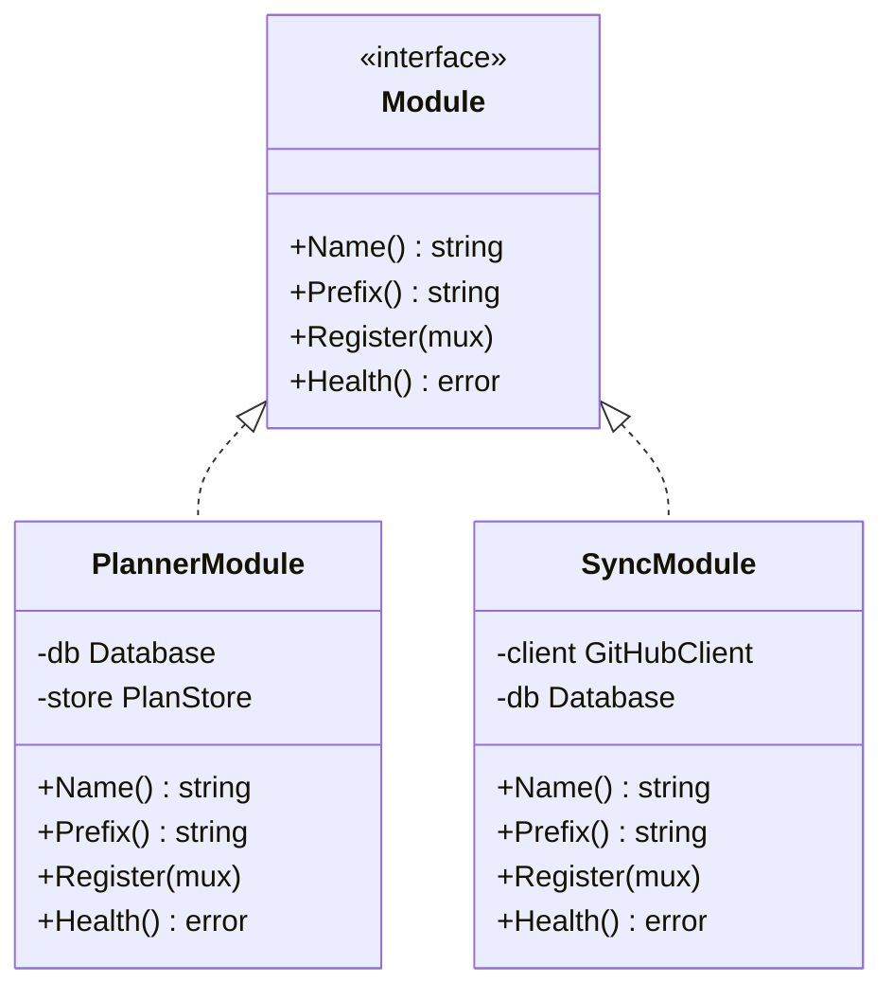
```mermaid
classDiagram
    class Module {
        <<interface>>
        +Name() string
        +Prefix() string
        +Register(mux)
        +Health() error
    }
    class PlannerModule {
        -db Database
        -store PlanStore
        +Name() string
        +Prefix() string
        +Register(mux)
        +Health() error
    }
    class SyncModule {
        -client GitHubClient
        -db Database
        +Name() string
        +Prefix() string
        +Register(mux)
        +Health() error
    }
    Module <|.. PlannerModule
    Module <|.. SyncModule
```

### State Diagram

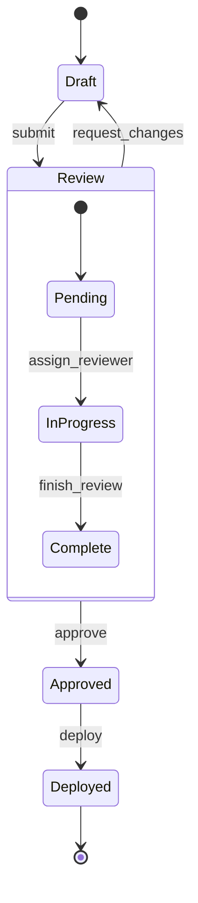
```mermaid
stateDiagram-v2
    [*] --> Draft
    Draft --> Review : submit
    Review --> Approved : approve
    Review --> Draft : request_changes
    Approved --> Deployed : deploy
    Deployed --> [*]

    state Review {
        [*] --> Pending
        Pending --> InProgress : assign_reviewer
        InProgress --> Complete : finish_review
    }
```

### Mindmap

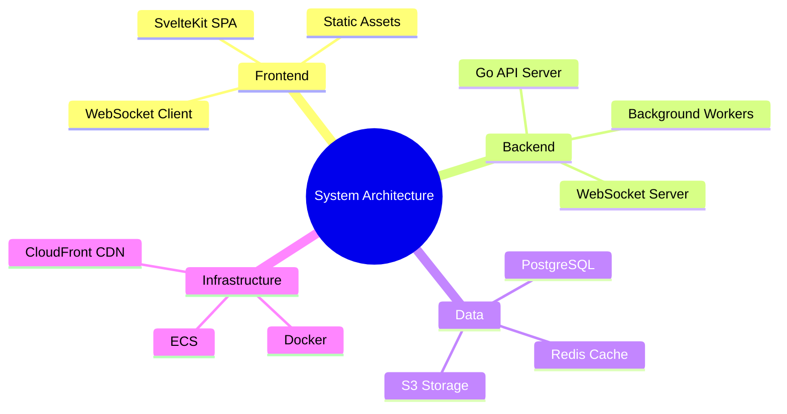
```mermaid
mindmap
    root((System Architecture))
        Frontend
            SvelteKit SPA
            Static Assets
            WebSocket Client
        Backend
            Go API Server
            Background Workers
            WebSocket Server
        Data
            PostgreSQL
            Redis Cache
            S3 Storage
        Infrastructure
            Docker
            ECS
            CloudFront CDN
```

### Timeline

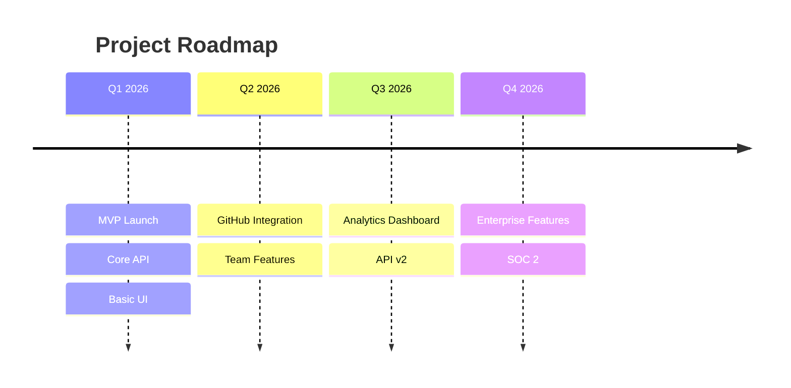
```mermaid
timeline
    title Project Roadmap
    Q1 2026 : MVP Launch
             : Core API
             : Basic UI
    Q2 2026 : GitHub Integration
             : Team Features
    Q3 2026 : Analytics Dashboard
             : API v2
    Q4 2026 : Enterprise Features
             : SOC 2
```

### Gantt Chart

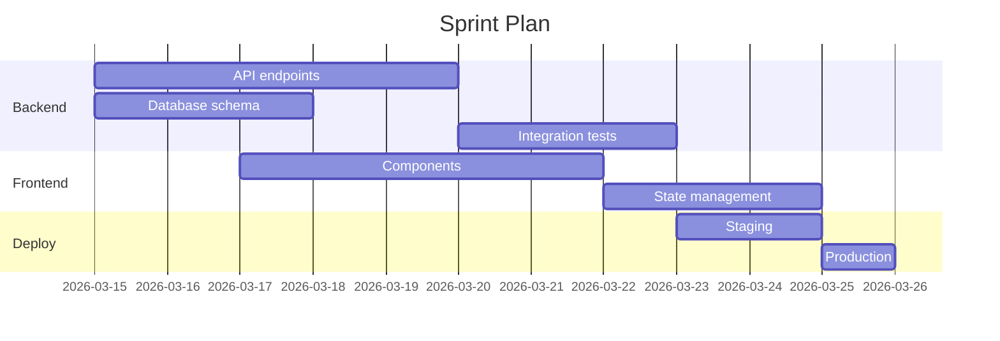
```mermaid
gantt
    title Sprint Plan
    dateFormat YYYY-MM-DD
    section Backend
        API endpoints    :a1, 2026-03-15, 5d
        Database schema  :a2, 2026-03-15, 3d
        Integration tests:a3, after a1, 3d
    section Frontend
        Components       :b1, 2026-03-17, 5d
        State management :b2, after b1, 3d
    section Deploy
        Staging          :c1, after a3, 2d
        Production       :c2, after c1, 1d
```

### User Journey

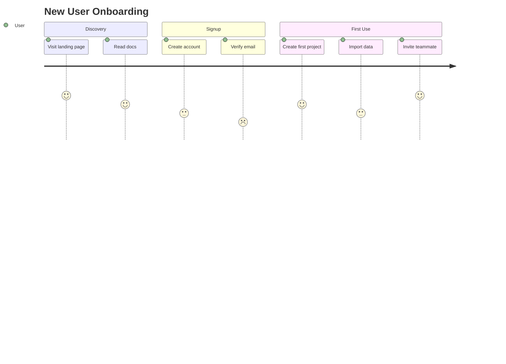
```mermaid
journey
    title New User Onboarding
    section Discovery
        Visit landing page: 5: User
        Read docs: 4: User
    section Signup
        Create account: 3: User
        Verify email: 2: User
    section First Use
        Create first project: 4: User
        Import data: 3: User
        Invite teammate: 5: User
```

### Git Graph

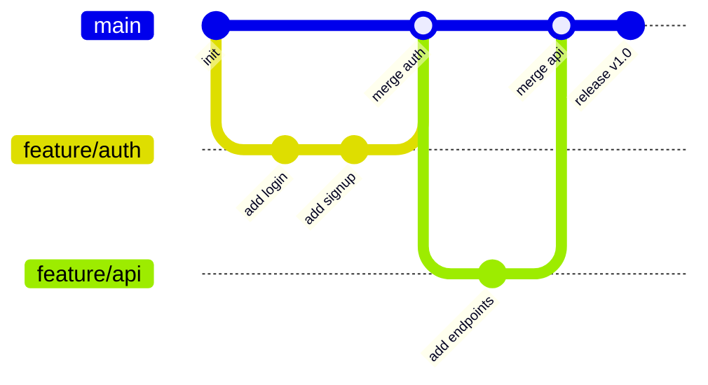
```mermaid
gitGraph
    commit id: "init"
    branch feature/auth
    checkout feature/auth
    commit id: "add login"
    commit id: "add signup"
    checkout main
    merge feature/auth id: "merge auth"
    branch feature/api
    checkout feature/api
    commit id: "add endpoints"
    checkout main
    merge feature/api id: "merge api"
    commit id: "release v1.0"
```

### Quadrant Chart

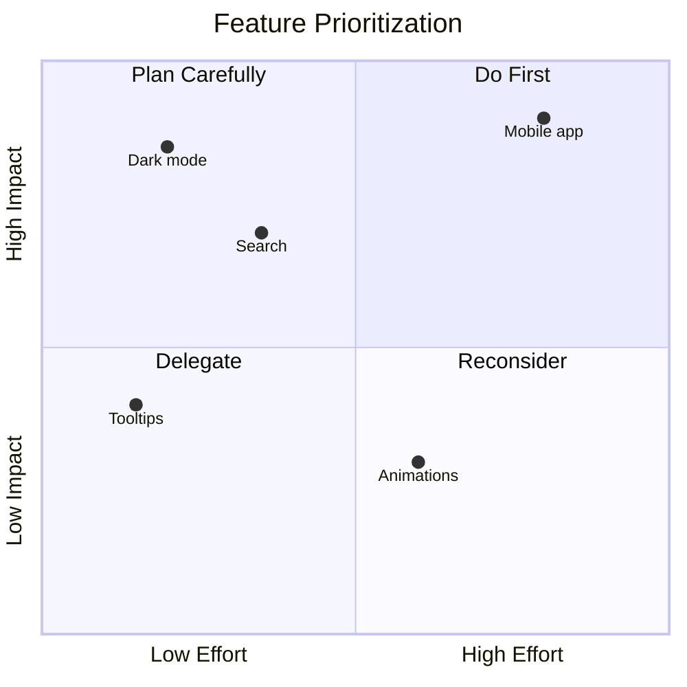
```mermaid
quadrantChart
    title Feature Prioritization
    x-axis Low Effort --> High Effort
    y-axis Low Impact --> High Impact
    quadrant-1 Do First
    quadrant-2 Plan Carefully
    quadrant-3 Delegate
    quadrant-4 Reconsider
    Dark mode: [0.2, 0.85]
    Search: [0.35, 0.7]
    Mobile app: [0.8, 0.9]
    Animations: [0.6, 0.3]
    Tooltips: [0.15, 0.4]
```

### XY Chart (bar/line)

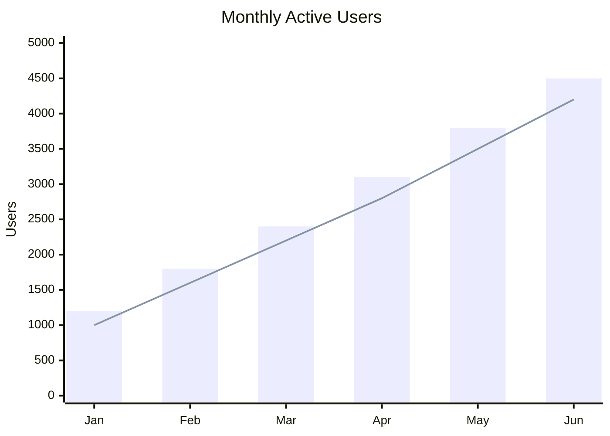
```mermaid
xychart-beta
    title "Monthly Active Users"
    x-axis [Jan, Feb, Mar, Apr, May, Jun]
    y-axis "Users" 0 --> 5000
    bar [1200, 1800, 2400, 3100, 3800, 4500]
    line [1000, 1600, 2200, 2800, 3500, 4200]
```

### Pie Chart

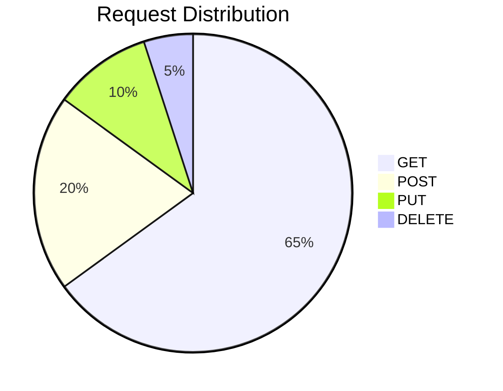
```mermaid
pie title Request Distribution
    "GET" : 65
    "POST" : 20
    "PUT" : 10
    "DELETE" : 5
```

## Browser Rendering

### Core API

```js
import mermaid from 'mermaid';

// Initialize once at app startup
mermaid.initialize({
  startOnLoad: false,
  theme: 'dark',           // 'default' | 'dark' | 'forest' | 'neutral' | 'base'
  securityLevel: 'loose',  // needed for click handlers
  logLevel: 'error',
});

// Render programmatically
const { svg } = await mermaid.render('diagram-unique-id', diagramDefinition);
container.innerHTML = svg;

// Validate without rendering
try {
  await mermaid.parse(diagramDefinition);
  // valid syntax
} catch (e) {
  // syntax error — e.message has details
}
```

### SvelteKit Integration

Mermaid uses DOM APIs — it must run client-side only.

```svelte
<script lang="ts">
  import { browser } from '$app/environment';

  let { definition }: { definition: string } = $props();
  let container: HTMLDivElement;
  let error = $state<string | null>(null);

  $effect(() => {
    if (!browser || !container || !definition) return;

    let cancelled = false;
    const id = `mermaid-${crypto.randomUUID()}`;

    (async () => {
      const mermaid = (await import('mermaid')).default;
      mermaid.initialize({
        startOnLoad: false,
        theme: 'dark',
        themeVariables: {
          // Match your app's design tokens
          primaryColor: '#f59e0b',
          primaryTextColor: '#fafafa',
          primaryBorderColor: '#d97706',
          lineColor: '#6b7280',
          background: '#0d1117',
          mainBkg: '#1e293b',
          nodeBorder: '#475569',
          clusterBkg: '#111827',
          clusterBorder: '#374151',
          titleColor: '#f8fafc',
          edgeLabelBackground: '#1e293b',
          fontFamily: 'Inter, system-ui, sans-serif',
        },
      });

      try {
        await mermaid.parse(definition);
        if (cancelled) return;
        const { svg } = await mermaid.render(id, definition);
        if (cancelled) return;
        container.innerHTML = svg;
        error = null;
      } catch (e) {
        if (!cancelled) error = e instanceof Error ? e.message : 'Invalid diagram';
      }
    })();

    return () => { cancelled = true; };
  });
</script>

<div class="diagram-container">
  {#if error}
    <div class="diagram-error">{error}</div>
  {/if}
  <div bind:this={container} class="diagram-render"></div>
</div>

<style>
  .diagram-container {
    overflow-x: auto;
    padding: var(--space-4, 1rem);
  }
  .diagram-render :global(svg) {
    max-width: 100%;
    height: auto;
  }
  .diagram-error {
    color: var(--color-danger, #ef4444);
    font-family: monospace;
    font-size: var(--text-sm, 0.875rem);
    padding: var(--space-2, 0.5rem);
  }
</style>
```

### Lazy Loading Pattern

For apps where diagrams are not on every page, lazy-load to avoid the ~1.5MB bundle on initial load:

```ts
let mermaidModule: typeof import('mermaid') | null = null;

async function getMermaid() {
  if (!mermaidModule) {
    mermaidModule = await import('mermaid');
    mermaidModule.default.initialize({
      startOnLoad: false,
      theme: 'dark',
    });
  }
  return mermaidModule.default;
}
```

### Rendering Multiple Diagrams

Each `mermaid.render()` call needs a unique ID. When rendering a list of diagrams (e.g., in a plan with multiple steps):

```ts
const diagrams = [
  { key: 'context', definition: '...' },
  { key: 'sequence', definition: '...' },
];

for (const { key, definition } of diagrams) {
  const { svg } = await mermaid.render(`diagram-${key}`, definition);
  document.getElementById(`container-${key}`)!.innerHTML = svg;
}
```

## Dark Theme Configuration

### Using Built-in Dark Theme

```js
mermaid.initialize({ theme: 'dark' });
```

This is a good baseline. For tighter integration with a custom dark design system:

### Custom Theme Matching CSS Custom Properties

```js
mermaid.initialize({
  theme: 'base',
  themeVariables: {
    // Background
    background: '#0a0a0a',
    mainBkg: '#18181b',

    // Nodes
    primaryColor: '#f59e0b',        // accent/amber
    primaryTextColor: '#fafafa',
    primaryBorderColor: '#d97706',
    secondaryColor: '#27272a',
    secondaryTextColor: '#a1a1aa',
    secondaryBorderColor: '#3f3f46',
    tertiaryColor: '#1c1917',
    tertiaryTextColor: '#d6d3d1',
    tertiaryBorderColor: '#44403c',

    // Edges
    lineColor: '#71717a',

    // Text
    textColor: '#e4e4e7',
    titleColor: '#fafafa',

    // Clusters/subgraphs
    clusterBkg: '#111111',
    clusterBorder: '#333333',

    // Notes
    noteBkgColor: '#1c1917',
    noteTextColor: '#e7e5e4',
    noteBorderColor: '#44403c',

    // Labels
    edgeLabelBackground: '#18181b',

    // Typography
    fontFamily: 'Inter, system-ui, sans-serif',
    fontSize: '14px',
  },
});
```

### Per-Diagram Theme Override

Embed directly in diagram definition (useful when the agent generates themed diagrams):

```
%%{init: {'theme': 'base', 'themeVariables': {'primaryColor': '#f59e0b', 'background': '#0a0a0a'}}}%%
flowchart LR
    A --> B
```

## LLM Generation Best Practices

### Rules for Generating Valid Mermaid

1. **Always quote labels with special characters** — wrap in `["..."]`:
   ```
   A["API Gateway (v2)"] --> B["Auth & Sessions"]
   ```
   Characters that break unquoted labels: `( ) [ ] { } | & # ; :`

2. **Use unique node IDs** — never reuse an ID with a different label:
   ```
   %% WRONG: redefines A
   A["Service A"] --> B
   A["Service B"] --> C

   %% CORRECT
   svcA["Service A"] --> B
   svcB["Service B"] --> C
   ```

3. **Limit complexity** — keep diagrams under 15-20 nodes. Break larger systems into multiple diagrams at different abstraction levels (the C4 model approach).

4. **Choose the right direction** — `LR` for wide flows, `TB` for deep hierarchies.

5. **Validate before rendering** — always call `mermaid.parse()` first.

6. **Escape in edge labels** — use quotes:
   ```
   A -->|"JSON/HTTPS"| B
   ```

7. **Avoid long labels** — keep under 40 characters. Use abbreviations or split across lines with `<br/>`.

### Prompt Template for Clean Diagram Output

When asking an LLM to generate a diagram:

```
Generate a Mermaid {diagram_type} diagram showing {description}.

Rules:
- Output ONLY the Mermaid code (no explanation, no code fence)
- Wrap all node labels in ["double-quoted brackets"]
- Use descriptive but short node IDs (camelCase, max 15 chars)
- Maximum 15 nodes
- Quote all edge labels with |"label"|
- Use {direction} direction
```

### Two-Pass Generation for Complex Diagrams

For reliability with complex systems, use a structured two-pass approach:

**Pass 1** — Ask the LLM to output JSON:
```json
{
  "nodes": [
    { "id": "api", "label": "API Server", "group": "backend" },
    { "id": "db", "label": "PostgreSQL", "group": "data" }
  ],
  "edges": [
    { "from": "api", "to": "db", "label": "SQL" }
  ]
}
```

**Pass 2** — Programmatically convert to Mermaid syntax. This eliminates syntax errors entirely.

### Common LLM Failure Modes and Fixes

| Failure | Cause | Fix |
|---------|-------|-----|
| Parse error on label | Special characters | Wrap in `["..."]` |
| Duplicate node definitions | Same ID, different labels | Post-process to deduplicate |
| Spaghetti layout | Too many nodes/edges | Limit to 15 nodes, use subgraphs |
| Wrong diagram type keyword | Hallucinated syntax | Validate against known types |
| Subgraph not closed | Missing `end` keyword | Post-process to ensure matching `end` |

## Accessibility

### Required for Every Diagram

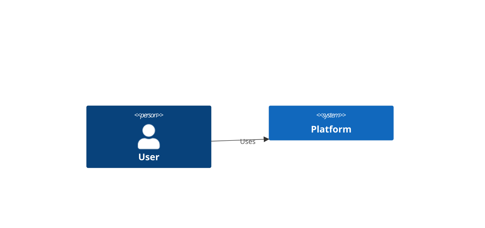
```mermaid
---
accTitle: System Context Diagram
accDescr: Shows user interactions with the platform and external services
---
C4Context
    Person(user, "User")
    System(app, "Platform")
    Rel(user, app, "Uses")
```

### HTML Wrapper Pattern

```html
<figure role="img" aria-label="System architecture diagram">
  <div class="mermaid-container">
    <!-- rendered SVG injected here -->
  </div>
  <figcaption>
    System architecture showing the API server, database, and external service connections.
  </figcaption>
</figure>
```

### Guidelines

- Always include `accTitle` and `accDescr` in diagram source
- Wrap in `<figure>` with `<figcaption>` providing a text description
- Use inline SVG (not ``) so screen readers can access text elements
- Don't rely on color alone — use labels on all connections
- Ensure sufficient contrast (Mermaid dark theme generally passes WCAG AA)
- Respect `prefers-reduced-motion` by disabling Mermaid animations

## Advanced: Graphviz WASM Fallback

For DOT-language graphs or when you need Graphviz's layout algorithms:

```ts
import Viz from '@viz-js/viz';

const viz = await Viz.instance();
const svg = viz.renderSVGElement('digraph { rankdir=LR; a -> b -> c; }');
document.body.appendChild(svg);
```

Bundle: ~2MB WASM. Lazy-load the same way as Mermaid.

## Advanced: ELK.js + Svelte Flow for Interactive Diagrams

When you need draggable, interactive architecture diagrams:

```ts
import ELK from 'elkjs/lib/elk.bundled.js';

const elk = new ELK();
const layout = await elk.layout({
  id: 'root',
  layoutOptions: { 'elk.algorithm': 'layered', 'elk.direction': 'RIGHT' },
  children: [
    { id: 'api', width: 150, height: 60 },
    { id: 'db', width: 150, height: 60 },
  ],
  edges: [{ id: 'e1', sources: ['api'], targets: ['db'] }],
});
// layout.children[0].x, layout.children[0].y → feed into Svelte Flow
```

Pair with `@xyflow/svelte` for the rendering layer. ELK handles layout (~180KB), Svelte Flow handles rendering/interaction (~80KB).

## Quick Decision Matrix

| Scenario | Approach |
|----------|----------|
| Agent generates diagram in a plan/doc | Mermaid, render client-side |
| User views system architecture overview | C4Context/C4Container in Mermaid |
| Show API request flow | Mermaid sequenceDiagram |
| Interactive, editable diagram | ELK.js + Svelte Flow |
| Need PlantUML/D2/Structurizr rendering | Kroki server (Docker) |
| Dependency graph from code analysis | Graphviz WASM (@viz-js/viz) |
| Simple box-and-arrow in markdown | Mermaid flowchart |
